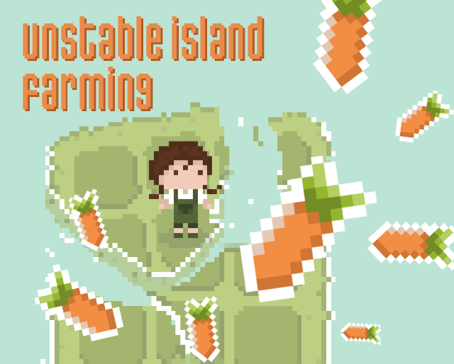

# Unstable Island Farming

[Yumao](https://github.com/devyumao) and [Ovilia](https://github.com/Ovilia)'s entry for [Ludum Dare 49](https://ldjam.com/events/ludum-dare/49).

[Play!]()

Goal: Grow 40 carrots on the unstable island.

Controls: left/right/top/bottom to move, and <kbd>space</kbd> to do anything else. When you hit <kbd>space</kbd>, you should always follow the beat. Otherwise, there will be an earthquake and all your efforts are in vain.

Hints: When you grow certain amounts of carrots, more islands are unlocked. It's a good idea to grow on different islands so that you don't lose all the carrots when one island sinks.
